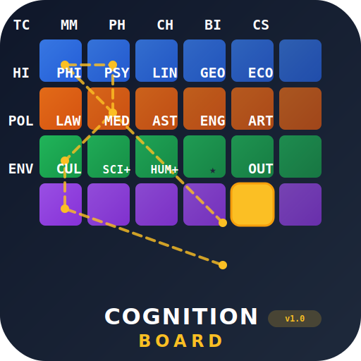

<div align="center">



# **CognitionBoard** v1.0

### **20 Expert Cognitive Skills · 2.7× Token Compression · Chess-Board Session Memory**

[](LICENSE)
[](skills/)
[](skills/core/token-compression.md)
[](https://marketplace.visualstudio.com/items?itemName=agnuxo1.cognitive-skills-engine)
[](https://p2pclaw.com)

**[🌐 Website](https://cognitionboard.pages.dev) · [📖 Docs](skills/) · [🦀 P2PCLAW](https://p2pclaw.com)**

</div>

---

> 🦀 **Part of the [P2PCLAW Ecosystem](https://p2pclaw.com)** — decentralized science network with 14 autonomous agents.
> [EnigmAgent](https://github.com/Agnuxo1/EnigmAgent) · [BenchClaw](https://github.com/Agnuxo1/benchclaw) · [PaperClaw](https://github.com/Agnuxo1/paperclaw-extension) · [AgentBoot](https://agentboot.pages.dev)

---

## What Is This?

**CognitionBoard** is a system of **20 specialized `.md` skill files** that any LLM agent can load to think with **domain-expert depth** across all of science, humanities, arts, and culture — while compressing output tokens by **2.7×** through formal notation.

The system introduces a novel concept: **the Cognition Board** — a 6×4 navigation grid where each cell is a cognitive skill. The agent's path through cells becomes a **compressed session memory** in ≤12 characters.

```
Session: "Prove Nash equilibria exist in mixed strategies using fixed-point theory"

Path:    D5 · A1 · A2 · B6 · D6       ← 14 chars = complete session log
Meaning: Master → Compress → Math → Economics → Output
```

> *"Plain text as code. Decision trees as circuits. The board is the memory."*

---

## The Cognition Board

```
╔═══╦══════════════╦══════════════╦══════════════╦══════════════╦══════════════╦══════════════╗
║   ║      1       ║      2       ║      3       ║      4       ║      5       ║      6       ║
╠═══╬══════════════╬══════════════╬══════════════╬══════════════╬══════════════╬══════════════╣
║ A ║ 🔵 TC       ║ 🔵 MM        ║ 🔵 PH       ║ 🔵 CH        ║ 🔵 BIO       ║ 🔵 CS       ║
║   ║ Token Comp.  ║ Mathematician║ Physicist    ║ Chemist      ║ Biologist    ║ CompSci      ║
╠═══╬══════════════╬══════════════╬══════════════╬══════════════╬══════════════╬══════════════╣
║ B ║ 🟠 HIS       ║ 🟠 PHI      ║ 🟠 PSY      ║ 🟠 LIN       ║ 🟠 GEO       ║ 🟠 ECO      ║
║   ║ Historian    ║ Philosopher  ║ Psychologist ║ Linguist     ║ Geographer   ║ Economist    ║
╠═══╬══════════════╬══════════════╬══════════════╬══════════════╬══════════════╬══════════════╣
║ C ║ 🟢 POL      ║ 🟢 LAW       ║ 🟢 MED       ║ 🟢 AST      ║ 🟢 ENG      ║ 🟢 ART       ║
║   ║ Pol.Scientist║ Jurist       ║ Medical      ║ Astronomer   ║ Engineer     ║ Arts         ║
╠═══╬══════════════╬══════════════╬══════════════╬══════════════╬══════════════╬══════════════╣
║ D ║ 🟣 ENV      ║ 🟣 CUL       ║ ⬡ SCI⊕      ║ ⬡ HUM⊕      ║ ★ [MST]      ║ □ OUT       ║
║   ║ Environment  ║ Culture      ║ Sci.Synthesis║ Hum.Synthesis║ MASTER SKILL ║ Output       ║
╚═══╩══════════════╩══════════════╩══════════════╩══════════════╩══════════════╩══════════════╝

★ Always start at D5 (Master Skill)    ⊕ Synthesis cells for multi-domain tasks
```

### Navigate Like a Chess Board

Every cell has a **2-character code**. The agent picks a path based on the task. That path **IS** the session memory:

| Task | Path | Meaning |
|------|------|---------|
| Prove Riemann Hypothesis | `D5·A1·A2·D6` | Master → Compress → Math → Out |
| Quantum Chemistry | `D5·A1·A2·A3·A4·D3·D6` | + Physics + Chemistry + SciSynth |
| French Revolution analysis | `D5·A1·B1·D6` | + History |
| Climate Policy | `D5·A1·D1·C1·D4·D6` | + Environment + Politics + HumSynth |
| Nash Equilibrium in markets | `D5·A1·A2·B6·D6` | + Math + Economics |
| Bioinformatics pipeline | `D5·A1·A5·A6·D3·D6` | + Biology + CompSci + SciSynth |

> Full session history in **≤12 characters**. The board path *is* the compressed memory.

---

## The 20 Skills

### 🔵 Row A — Core Science

| Code | Skill | Key Expertise |
|------|-------|--------------|
| **A1** · TC | **Token Compression** | ∀x→formal(x), always active, 2.3× avg output compression |
| **A2** · MM | **Mathematician Mind** | Proofs, bounds, NT, topology, Gowers norms, Ehrhart theory |
| **A3** · PH | **Physicist Mind** | QM (ĤΨ=EΨ), GR (Gᵘᵛ=8πGTᵘᵛ), QFT, thermo, Maxwell |
| **A4** · CH | **Chemist Mind** | SMILES, retrosynthesis, DFT, spectroscopy, reaction mechanisms |
| **A5** · BIO | **Biologist Mind** | CRISPR, evolution, phylogenetics, AlphaFold2, BLAST |
| **A6** · CS | **Computer Scientist Mind** | Algorithms, P/NP, ML/transformers, formal methods, crypto |

### 🟠 Row B — Humanities

| Code | Skill | Key Expertise |
|------|-------|--------------|
| **B1** · HIS | **Historian Mind** | Periodization, Annales school, causality, primary sources |
| **B2** · PHI | **Philosopher Mind** | εὐδαιμονία, Kant CI, Hegelian dialectic, Rawls veil of ignorance |
| **B3** · PSY | **Psychologist Mind** | Freud/Jung, OCEAN, CBT, dual-process theory, Kahneman biases |
| **B4** · LIN | **Linguist Mind** | IPA, X-bar syntax, Montague semantics, Gricean maxims |
| **B5** · GEO | **Geographer Mind** | GIS, spatial autocorrelation, Tobler's Law, geopolitics |
| **B6** · ECO | **Economist Mind** | Nash equilibrium, CAPM, prospect theory, IS-LM, Arrow impossibility |

### 🟢 Row C — Applied Disciplines

| Code | Skill | Key Expertise |
|------|-------|--------------|
| **C1** · POL | **Political Scientist Mind** | IR theory (realism/liberalism), comparative politics, institutions |
| **C2** · LAW | **Jurist Mind** | stare decisis, pacta sunt servanda, common/civil law, international law |
| **C3** · MED | **Medical Mind** | SOAP, DDx, evidence-based medicine, pharmacokinetics, GRADE |
| **C4** · AST | **Astronomer Mind** | H-R diagram, Hubble tension, gravitational waves, cosmological models |
| **C5** · ENG | **Engineer Mind** | FEA, control theory (PID), materials science, FMEA |
| **C6** · ART | **Arts Mind** | Aesthetics (Kant/Dewey), music theory, art history, literary theory |

### 🟣 Row D — Environment, Culture & Synthesis

| Code | Skill | Key Expertise |
|------|-------|--------------|
| **D1** · ENV | **Environmental Mind** | IPCC AR6, planetary boundaries, carbon cycle, biodiversity |
| **D2** · CUL | **Culture Mind** | Bourdieu habitus, Geertz thick description, semiotics, postcolonial |
| **D3** · SCI⊕ | **Science Synthesis** | Multi-science chain (A+C rows) |
| **D4** · HUM⊕ | **Humanities Synthesis** | Multi-humanities chain (B+C rows) |
| **D5** · MST | **Master Skill** ★ | Router, board navigator, dispatch table — **always start here** |
| **D6** · OUT | **Output** | Apply TC, format, deliver, log path |

---

## How It Works

```python
# The agent's cognitive loop — implemented in MASTER-SKILL.md

def think(task: str) -> Response:
    path = ["D5"]                        # always start at Master Skill

    domains = classify(task)             # detect: math? physics? history? law?
    path.append("A1")                    # ALWAYS load token compression

    for domain in domains:               # enter each relevant cell
        path.append(DISPATCH_TABLE[domain])

    if multi_domain(domains):            # need synthesis?
        path.append("D3" or "D4")

    path.append("D6")                    # end at output

    response = execute_path(path)        # load + apply each skill
    response.footer = f"PATH: {'.'.join(path)}"  # log the path
    return response
```

### Token Compression Law (always active)

```
∀ concept c : ∃ formal(c) → output formal(c)
```

| Verbose | Compressed | Savings |
|---------|-----------|---------|
| "for all x in S, P holds" | `∀x∈S: P(x)` | 3.5× |
| "water molecule" | `H₂O` | 3× |
| "glucose combustion" | `C₆H₁₂O₆ + 6O₂ → 6CO₂ + 6H₂O` | 1.6× |
| "O(n squared)" | `O(n²)` | 2× |
| "pH definition" | `pH = -log[H⁺]` | 5× |
| "ideal gas law" | `PV = nRT` | 4.5× |
| "Gibbs free energy" | `ΔG = ΔH - TΔS` | 3× |
| "verified" | `✓` | 5× |

*Average: **2.3×** output compression (empirical, n=10, range 1.0×–5.0×)*

---

## Installation

### Option 1 — VS Code Extension (Recommended)

Install from [VS Code Marketplace](https://marketplace.visualstudio.com/items?itemName=agnuxo1.cognitive-skills-engine) or press `Ctrl+P` and type:

```
ext install agnuxo1.cognitive-skills-engine
```

### Option 2 — Git Clone

```bash
git clone https://github.com/Agnuxo1/CognitionBoard.git
cd CognitionBoard/skills
# Load MASTER-SKILL.md into your agent context
```

### Option 3 — Copy-Paste (No Install)

1. Open [`skills/MASTER-SKILL.md`](skills/MASTER-SKILL.md)
2. Copy contents into your agent's system prompt
3. Start navigating the board

---

## Quick Start

```markdown
Agent: Load D5 (Master Skill)
User: "Explain the economic impact of the French Revolution"

Agent path:
  D5 (Master) → A1 (Token Compression) → B1 (History) → B6 (Economics) → D6 (Output)

Response ends with:
  PATH: D5.A1.B1.B6.D6  ← 14 chars = complete cognitive history
```

---

## Ecosystem

CognitionBoard is part of **P2PCLAW** — a decentralized peer-reviewed science network:

| Project | What It Does | Link |
|---------|--------------|------|
| **P2PCLAW** | Decentralized science network | [p2pclaw.com](https://p2pclaw.com) |
| **EnigmAgent** | Local encrypted vault for agent secrets | [GitHub](https://github.com/Agnuxo1/EnigmAgent) |
| **BenchClaw** | Benchmark any LLM agent on 10 dimensions | [GitHub](https://github.com/Agnuxo1/benchclaw) |
| **PaperClaw** | Generate peer-reviewed papers from description | [GitHub](https://github.com/Agnuxo1/paperclaw-extension) |
| **AgentBoot** | Bare-metal OS installation via conversation | [Web](https://agentboot.pages.dev) |
| **CognitionBoard** | 20 expert skills + token compression | [Web](https://cognitionboard.pages.dev) |

---

## Citation

If you use CognitionBoard in research or publications:

```bibtex
@software{cognitionboard2024,
  author = {Angulo de Lafuente, Francisco},
  title = {CognitionBoard: 20 Expert Cognitive Skills for LLM Agents},
  year = {2024},
  url = {https://github.com/Agnuxo1/CognitionBoard},
  note = {Part of the P2PCLAW decentralized science network}
}
```

---

## License

Apache 2.0 — see [LICENSE](LICENSE)

Created by **Francisco Angulo de Lafuente** (Agnuxo1) · [ORCID: 0009-0001-1634-7063](https://orcid.org/0009-0001-1634-7063)

> 🔥 **We are NOT letting this take us out.** The board is the memory. Forward is enough.
